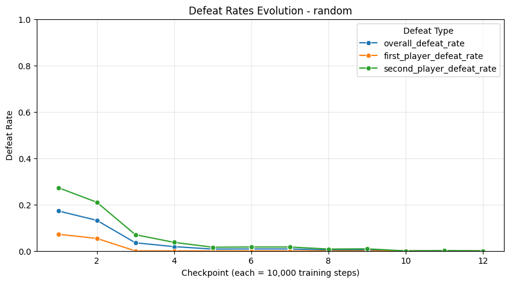

# 🎮 Tic-Tac-Toe Reinforcement Learning Agent


This project focuses on training a Tic-Tac-Toe agent using **Proximal Policy Optimization (PPO)** with action masking.  
The goal is to train an agent capable of defeating random, smart-random, and previous PPO models while tracking detailed performance statistics.

---

## 📋 Table of Contents

1. [About](#about)
2. [Environment](#environment)
3. [Installation](#installation)
4. [Project Structure](#project-structure)
5. [Training](#training)
6. [Evaluation](#evaluation)
7. [Visualization](#visualization)
8. [Demo](#demo)
9. [Packages / Environment](#packages--environment)
10. [Contributing](#contributing)
11. [License](#license)
12. [Conclusion](#conclusion)
13. [Contact](#contact)


---

## About

The Tic-Tac-Toe RL project aims to train an agent to play optimally against multiple opponent types:

- **Random agent**
- **Smart random agent**
- Previously trained PPO agents

The agent learns using **MaskablePPO** with dynamic training parameters and tracks detailed statistics including defeat rates as first or second player.

---

## Environment

The agent is trained in a custom Gymnasium-based environment:

- Board size: 3x3 (configurable)
- Victory pattern length: 3 (configurable)
- Action masking ensures illegal moves cannot be selected
- Lost games are saved for review
- Opponent statistics are tracked and stored

---

## Installation

1. Clone the repository:

```bash
    git clone https://github.com/lategardener/morpion_RL.git
    cd morpion_RL
```
2. Create and activate a virtual environment:
```bash
    python -m venv venv
    source venv/bin/activate      # Linux/macOS
    venv\Scripts\activate         # Windows
```
3. Install dependencies:
```bash
    pip install -r requirements.txt
```
---
## Project Structure

```
tic-tac-toe-ppo/
├── agents
├── configs
├── defeat_games
├── demo
├── envs
├── gameboard_images
├── model
├── test
├── training
├── utils
└── README.md
```
---

## Training

Training is handled via [training/train.ipynb](training/train.ipynb)

- Discount factor (GAMMA): 0.95

- GAE lambda: 0.95

- Entropy coefficient (ent_coef): 0.01

- Learning rate: dynamically decreasing

- Checkpoint interval: configurable

- Early stopping: triggered when all defeat rates reach 0

---

## Evaluation

The agent is evaluated over **1,000 episodes** against each type of opponent.  
We track the **defeat rates** from three perspectives:
- As the **first player**
- As the **second player**
- **Overall** (combined)

To ensure statistical robustness, we also compute the **95% confidence interval (CI)** for the defeat rate of each evaluation.  
Even when the observed defeat rate reaches **0%** against both opponents, the confidence interval provides an upper bound on the true defeat probability.

For example, with 0 defeats over 1,000 games:
- Observed defeat rate = **0%**
- 95% CI for defeat rate ≈ **[0%, 0.3%]**
> This means that although no defeats were observed, the true defeat rate is very likely to be below 0.3% with 95% confidence.

---

## Visualization

Tracks first player, second player, and overall defeat rates over 1000 evaluation episodes.

- **Against Random**  
  

- **Against Smart Random**  
  

---

<br><br>
## Demo

<br>
<div align="center">
  
</div>

---

## Packages / Environment

This project uses the following main packages and versions:

- gymnasium==1.1.1
- matplotlib==3.10.5
- numpy==2.3.2
- pandas==2.3.1
- Pillow==11.3.0
- PySide6==6.9.0
- PySide6==6.9.1
- PySide6_Addons==6.9.0
- PySide6_Essentials==6.9.0
- rich==14.1.0
- sb3_contrib==2.6.0
- seaborn==0.13.2
- stable_baselines3==2.6.0
- torch==2.6.0

---

## Contributing

Contributions are welcome!  
If you want to improve this project, please follow these steps:

1. Fork the repository.
2. Create a new branch (`git checkout -b feature/your-feature`).
3. Commit your changes (`git commit -m 'Add some feature'`).
4. Push to the branch (`git push origin feature/your-feature`).
5. Open a Pull Request.

Please make sure your code follows the existing style and passes any tests.

---

## License

This project is licensed under the MIT License.  
See the [LICENSE](./LICENSE) file for details.

---

## Conclusion

This project implemented a **Reinforcement Learning agent** for Tic-Tac-Toe using **MaskablePPO**, capable of playing against **random**, **smart random**, and previous PPO agents.

Key points:

- **Heuristics to speed up learning** were implemented, inspired by [this study](references/heuristic_parameters_n_aligned.pdf). You can see the implementation in [utils/heuristics.py](utils/heuristics.py).
- The **neural network architecture** was customized. For the 3x3 board, a simple **MLP** is used. You can find the model definition in [training/config.py](training/config.py), and other architectures can be implemented for different board sizes.


This demonstrates that combining **Reinforcement Learning with heuristics** can produce a strong agent for structured games like Tic-Tac-Toe.


---

## Contact

If you have any questions or want to get in touch, feel free to contact me:  
**Marc Djole**  
Email: [djolemarc@cy-tech.fr](mailto:djolemarc@cy-tech.fr)  
GitHub: [https://github.com/lategardener](https://github.com/lategardener)

---


