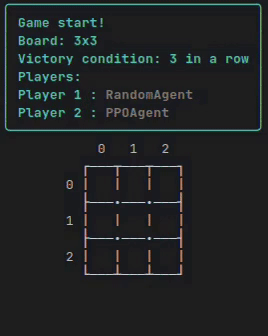

# 🎮 Tic-Tac-Toe Reinforcement Learning Agent


This project focuses on training a Tic-Tac-Toe agent using **Proximal Policy Optimization (PPO)** with action masking.  
The goal is to train an agent capable of defeating random, smart-random, and previous PPO agents while tracking detailed performance statistics.

---

## 📋 Table of Contents

1. [About](#about)
2. [Environment](#environment)
3. [Installation](#installation)
4. [Project Structure](#project-structure)
5. [Training](#training)
6. [Evaluation](#evaluation)
7. [Visualization](#visualization)
8. [Run the Game](#Run-the-game)
9. [Demo](#demo)
10. [Packages / Environment](#packages--environment)
11. [Contributing](#contributing)
12. [License](#license)
13. [Conclusion](#conclusion)
14. [Contact](#contact)

---

## About

The Tic-Tac-Toe RL project aims to train an agent to play optimally against multiple opponent types:

- **Random agent**
- **Smart random agent** – an evolved random agent that **wins immediately when possible, blocks the opponent if they are about to win, otherwise plays randomly**.
- Previously trained PPO agents

The agent learns using **MaskablePPO** with dynamic training parameters and tracks detailed statistics including defeat rates as first or second player.

---

## Environment

The agent is trained in a custom Gymnasium-based environment:

- Board size: 3x3 (configurable)
- Victory pattern length: 3 (configurable)
- Action masking ensures illegal moves cannot be selected
- Lost games are saved for review
- Opponent statistics are tracked and stored

---

## Installation

1. Clone the repository:

```bash
    git clone https://github.com/lategardener/morpion_RL.git
    cd morpion_RL
```
2. Create and activate a virtual environment:
```bash
    python -m venv venv
    source venv/bin/activate      # Linux/macOS
    venv\Scripts\activate         # Windows
```
3. Install dependencies:
```bash
    pip install -r requirements.txt
```
---
## Project Structure

```
├── agents
├── best_agents
├── configs
├── demo
├── envs
├── graphics
├── LICENSE
├── play
├── README.md
├── references
├── requirements.txt
├── trained_agents
├── training
└── utils
```
---

## Training

Training is handled via [training/train.ipynb](training/train.ipynb)

- Discount factor (GAMMA): 0.95

- GAE lambda: 0.95

- Entropy coefficient (ent_coef): 0.01

- Learning rate: dynamically decreasing

- Checkpoint interval: configurable

- Early stopping: triggered when all defeat rates reach 0

---

## Evaluation

The agent is evaluated over **1,000 episodes** against each type of opponent.  
We track the **defeat rates** from three perspectives:
- As the **first player**
- As the **second player**
- **Overall** (combined)

To ensure statistical robustness, we also compute the **95% confidence interval (CI)** for the defeat rate of each evaluation.  
Even when the observed defeat rate reaches **0%** against both opponents, the confidence interval provides an upper bound on the true defeat probability.

For example, with 0 defeats over 1,000 games:
- Observed defeat rate = **0%**
- 95% CI for defeat rate ≈ **[0%, 0.3%]**
> This means that although no defeats were observed, the true defeat rate is very likely to be below 0.3% with 95% confidence.

---

## Visualization

Tracks first player, second player, and overall defeat rates over 1000 evaluation episodes.

- **Against Random**  
  

- **Against Smart Random**  
  

---

## Run The Game

You can play TicTacToe directly in the terminal using the `play/game.py` script.  
The game supports human players as well as AI agents (`RandomAgent`, `SmartRandomAgent`, PPO agents).

### Command-line arguments

| Flag | Description |
|------|-------------|
| `-p` | Board size (e.g., `-p 3` → 3x3 board) |
| `-w` | Victory pattern length (number of consecutive symbols needed to win) |
| `-f` | First player type (`human`, `random`, `smart_random`, or `agent`) |
| `-v` | Version of the PPO agent (used after `-f` or `-s`) |
| `-s` | Second player type (`human`, `random`, `smart_random`, or `agent`) |

#### Examples

1. **Human vs Random on a 3x3 board, 3 in a row to win:**

```bash
    python play/game.py -p 3 -w 3 -f human -s random
```

2. **PPO Agent v1 vs smart_random on a 3x3 board, 3 in a row to win:**

```bash
    python play/game.py -p 3 -w 3 -f agent -v 1 -s smart_random
```

### ⚠️ Important: PPO Agents

To play with PPO agents, you must first **train them** and then move the trained agents into the `best_agents/` folder.  
The agents must follow a strict naming convention:

`agent_v{version}_{board_length}x{board_length}_{victory_pattern_length}.zip`

- **`version`** → identifier of the agent (integer). It allows you to differentiate multiple agents trained on the **same board size** and **victory pattern**.
- **`board_length`** → board size (square), must match the size the agent was trained on.
- **`victory_pattern_length`** → number of consecutive symbols required to win, must also match the training configuration.


### Useful options

- **`-h`** → display help with a description of all parameters and an example of how to launch the game.
- **`-m`** → list all available agents in the `best_agents/` folder in a table format.

#### Example:

```bash
  # Show help
  python play/game.py -h

  # List available trained agents
  python play/game.py -m
```

---


## Demo

<br>
<div align="center">
  
</div>

---

## Packages / Environment

This project uses the following main packages and versions:

- gymnasium==1.1.1
- matplotlib==3.10.5
- numpy==2.3.2
- pandas==2.3.1
- Pillow==11.3.0
- rich==14.1.0
- sb3_contrib==2.6.0
- seaborn==0.13.2
- stable_baselines3==2.6.0
- torch==2.6.0

---

## Contributing

Contributions are welcome!  
If you want to improve this project, please follow these steps:

1. Fork the repository.
2. Create a new branch (`git checkout -b feature/your-feature`).
3. Commit your changes (`git commit -m 'Add some feature'`).
4. Push to the branch (`git push origin feature/your-feature`).
5. Open a Pull Request.

Please make sure your code follows the existing style and passes any tests.

---

## License

This project is licensed under the MIT License.  
See the [LICENSE](./LICENSE) file for details.

---

## Conclusion

This project implemented a **Reinforcement Learning agent** for Tic-Tac-Toe using **MaskablePPO**, capable of playing against **random**, **smart random**, and previous PPO agents.

Key points:

- **Heuristics to speed up learning** were implemented, inspired by the Master’s thesis of Abdel-Hafiz Abdoulaye ([Determining Parameters of a Generic Heuristic for N-Aligned Games via Machine Learning, IFRI-UAC, 2016-2017](docs/heuristic_parameters.pdf)). You can see the implementation in [training/heuristics.py](training/heuristics.py).

- The **neural network architecture** was customized. For the 3x3 board, a simple **MLP** is used. You can find the agent definition in [training/config.py](training/config.py), and other architectures can be implemented for different board sizes.


This demonstrates that combining **Reinforcement Learning with heuristics** can produce a strong agent for structured games like Tic-Tac-Toe.


---

## Contact

If you have any questions or want to get in touch, feel free to contact me:  
**Marc Djole**  
Email: [djolemarc@cy-tech.fr](mailto:djolemarc@cy-tech.fr)  
GitHub: [https://github.com/lategardener](https://github.com/lategardener)

---


